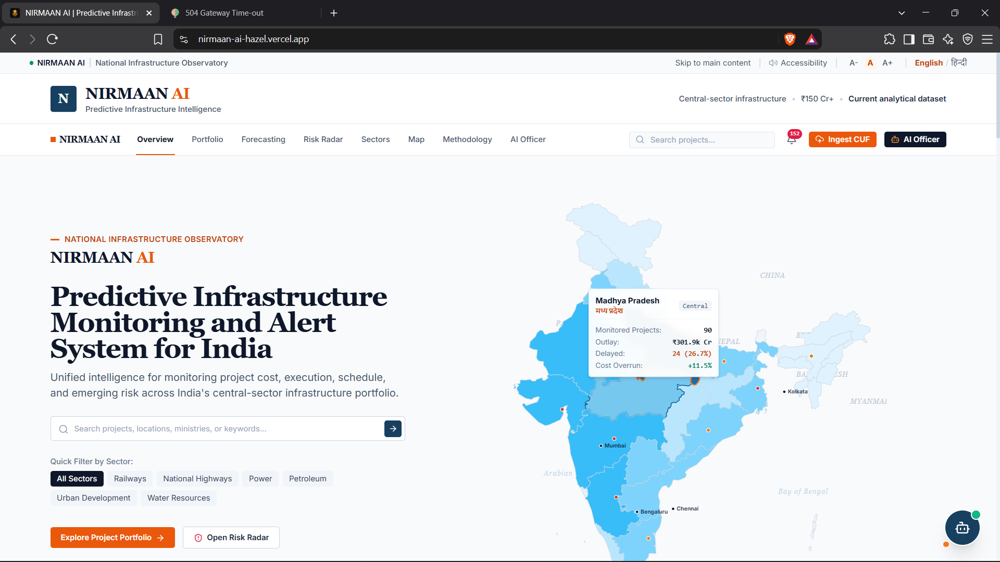
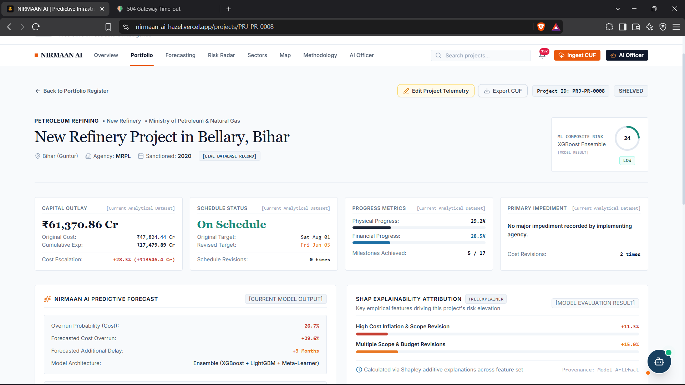
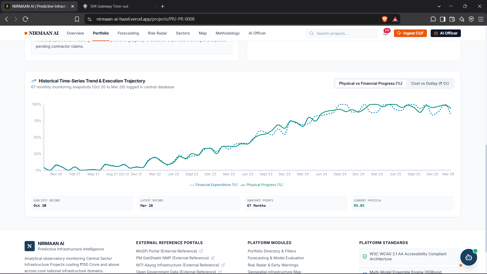
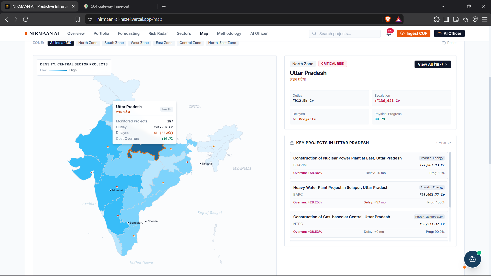
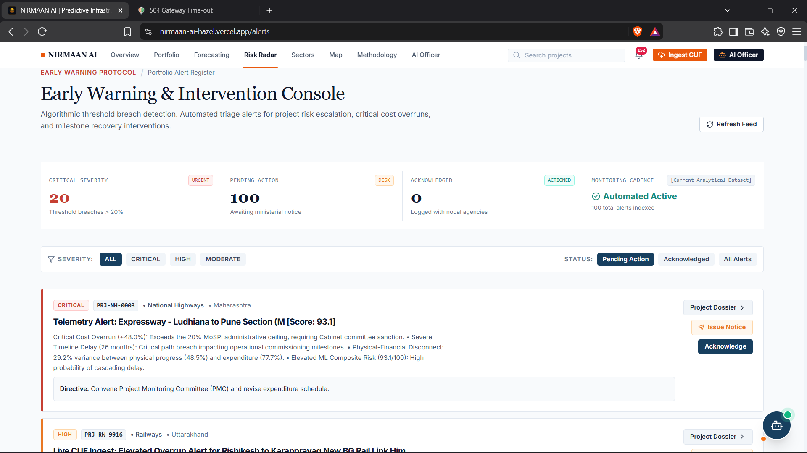
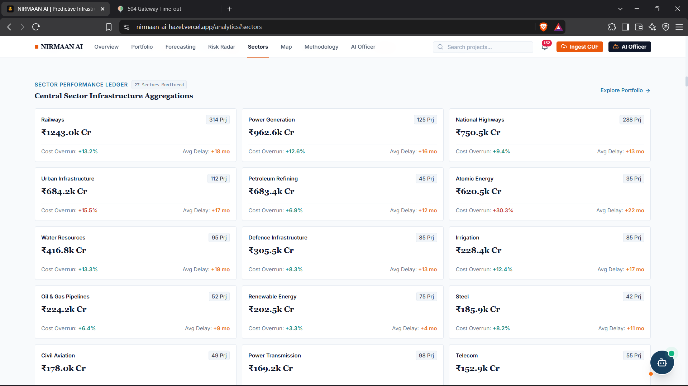
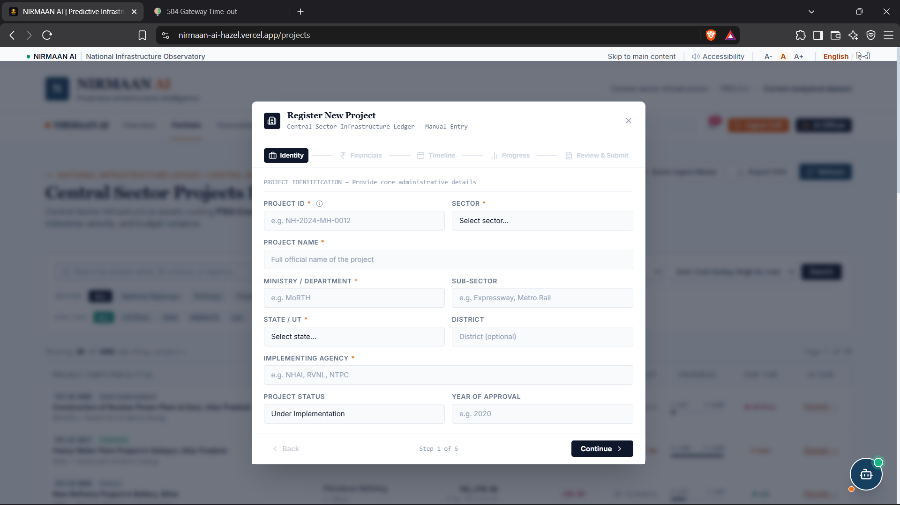
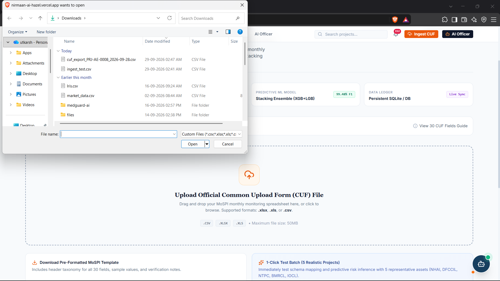
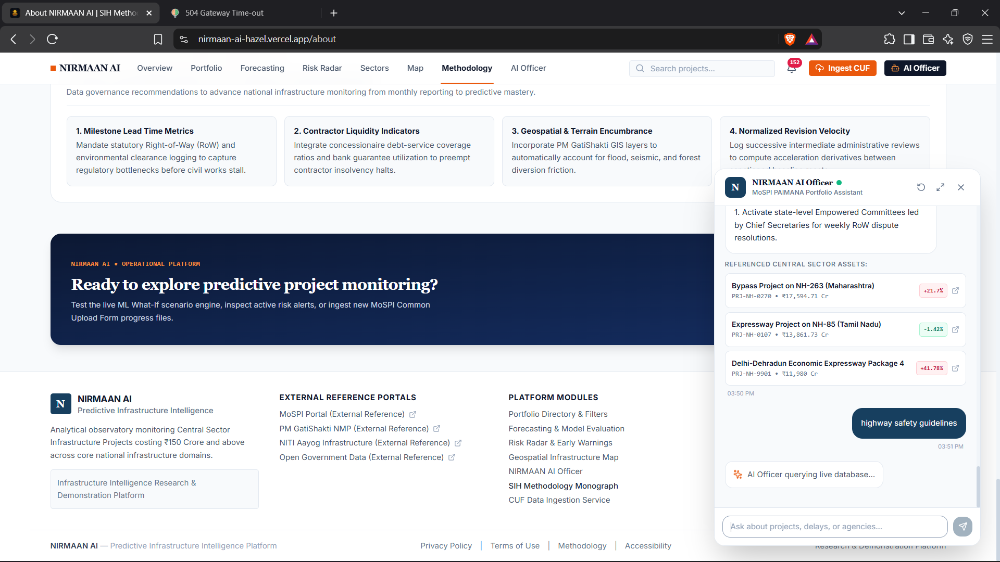

# NIRMAAN AI — Predictive Infrastructure Intelligence, Cost Overrun & Schedule Delay Analytics Platform

> **SIH 2026 Submission** | Problem Solution: AI for Infrastructure Monitoring — IPMD/MoSPI PAIMANA (Problem Statement Solution)  
> **Team:** Team Rescue-Arc  
> **Platform:** NIRMAAN AI (Project Assessment, Infrastructure Monitoring and Analytics for Nation-building)  


---

### 🔗 Live Platform & Solution Video

> 🚀 **Live Production Platform**: [https://nirmaan-ai-hazel.vercel.app/](https://nirmaan-ai-hazel.vercel.app/)  
> 📺 **Video Explanation & Solution Walkthrough**: [https://www.youtube.com/watch?v=h_9us3qxY3g](https://www.youtube.com/watch?v=h_9us3qxY3g)

[](https://nirmaan-ai-hazel.vercel.app/)
[](https://www.youtube.com/watch?v=h_9us3qxY3g)

---

## 🎯 What This Platform Does

NIRMAAN AI transforms India's PAIMANA infrastructure monitoring from **descriptive reporting** to **predictive and prescriptive decision-support**. It analyzes 1,931 Central Sector Infrastructure Projects (≥₹150 Crore) across 17 Ministries using a 3-model ML stacking ensemble to:

-   
  **Predict Cost Overrun Probability** before formal budget revision submissions ( **$99.48\%$**,  **$1.0$**) across 1,931+ Central Sector capital assets.

-   
  **Forecast Schedule Delay Months** in advance of milestone breaches ( **$91.26\%$**,  **$9.83\text{ months}$**) using dynamic project velocity curves.

-   
  **Score Every Project** with a standardized 0–100 composite risk index segmented into four operational priority tiers ( **$\ge 75$**,  **$50–74$**,  **$25–49$**,  **$< 25$**).

-   
  **Alert Monitoring Officers** with actionable early warning signals across 4 critical failure triggers (>20% cost overrun threshold, milestone delays, physical-financial variance, stagnant execution) with acknowledgement tracking.

-   
  **Explain Machine Learning Forecasts** using **SHAP (SHapley Additive exPlanations)** TreeExplainer attribution to isolate exact cost-escalation and delay drivers for ministerial accountability.

-   
  **Provide Institutional Decision Support** through an AI Officer powered by **Google Gemini 2.0 Flash** with live database telemetry and context injection for real-time natural language inquiries.

-   
  **Simulate What-If Policy Scenarios** and risk trajectories for new, proposed, or restructured infrastructure projects prior to formal capital outlay commitment.

-   
  **Empower Implementing Agencies & MoSPI** with automated Common Upload Form (CUF) ingestion, ministerial benchmarking scorecards, and multi-agency project dossier management.

---

## 📊 SIH Outcome Coverage

| Outcome | Description | Status |
|---|---|---|
| **a** | Cost Overrun Prediction Model | ✅ XGBoost + LightGBM + RF Ensemble. F1: 99.48%, AUC-ROC: 1.0 |
| **b** | Time Overrun Prediction Model | ✅ Time Ensemble F1: 91.26%. XGBoost regressor RMSE: 9.83 months |
| **c** | Project Risk Scoring Framework | ✅ 0–100 composite score. CRITICAL/HIGH/MODERATE/LOW tiers |
| **d** | Early Warning Alert System | ✅ 142 alerts. 4 alert types. Acknowledgement tracking |
| **e** | Benchmarking & Comparative Analytics | ✅ Cross-ministry scorecard. ML vs Conventional benchmark table |
| **f** | Cost Escalation Driver Analysis | ✅ SHAP decomposition. Delay reason frequency breakdown |
| **g** | AI-powered Monitoring Dashboard | ✅ Full Next.js 16 dashboard with live DB-backed KPIs |
| **h** | LLM-enabled Project Intelligence | ✅ Gemini 2.0 Flash integration with live DB context injection |
| **i** | Documentation & Deployment | ✅ Docker Compose (frontend + ML service). This README. |

**Technical Dimensions:**
- **Dim A:** 47 CUF-aligned features. XGBoost + LightGBM + RF + Stacking Meta-Learner. 5-fold Stratified CV.
- **Dim B:** Rule-based baseline F1: 79.67% → Ensemble F1: 99.48% (+24.9% relative gain)
- **Dim C:** CUF vs External feature taxonomy. Policy recommendations for 4 schema enhancements.

---

## 🖥️ Platform Interfaces & Key Modules

NIRMAAN AI provides a unified, interactive web interface for national infrastructure monitoring, risk triage, and predictive decision-support. Below is a comprehensive overview of the core platform interfaces:

### 1. Platform Overview & National Infrastructure Observatory


1. **Page Description:** The primary executive landing dashboard providing a macro-level overview of India's central-sector infrastructure assets (costing ₹150 Cr+). Features an interactive geospatial summary preview, live portfolio metrics (monitored projects, total outlay, delayed counts, and cost overrun rates), quick multi-parameter search, and sector filter shortcuts.
2. **Function:** Enables ministerial leadership and monitoring officers to immediately gauge portfolio health at a glance, execute rapid searches by keyword/state/agency, filter high-priority sectors (Railways, Highways, Power, Petroleum, Urban Development), and navigate directly to the Risk Radar or comprehensive project registry.

### 2. Central Sector Projects Directory (Portfolio)
.png)

1. **Page Description:** Central ledger indexing all 1,942+ active infrastructure projects with real-time ML risk tier classifications (Critical, High, Moderate, Low), sanctioned vs. current outlays, cost variance, schedule delay metrics, physical progress bars, and direct links to comprehensive dossiers.
2. **Function:** Allows officers to filter projects by sector, state/UT, project status (Under Implementation, Completed, Shelved), and algorithmic risk tier; sort by cost outlay, delay, or risk score; trigger bulk data ingestion; add new project records; and export filtered views to CSV for inter-departmental review.

### 3. Project Dossier & ML Predictive Intelligence


1. **Page Description:** Granular analytical profile for an individual infrastructure asset displaying live database telemetry, financial outlay breakdowns, schedule milestone targets, recorded project impediments, and predictive model forecasts accompanied by SHAP TreeExplainer feature attributions.
2. **Function:** Provides monitoring officers with deep visibility into project cost escalation and completion risk; displays stacking ensemble overrun probabilities and forecasted additional delay months; breaks down top empirical risk drivers using explainable SHAP values; and allows editing project telemetry or exporting project CUF records.

### 4. Historical Time-Series Trend & Execution Trajectory


1. **Page Description:** Longitudinal time-series analytics component tracking historical monthly monitoring snapshots across project lifecycles, charting physical progress percentage against cumulative financial expenditure percentage over time.
2. **Function:** Detects physical-financial disconnects (e.g., expenditure surges without corresponding physical completion), analyzes delivery velocity and acceleration over multi-year timelines, validates historical snapshot cadence, and provides empirical input curves for predictive modeling.

### 5. Geospatial Infrastructure Map & Regional Density


1. **Page Description:** Interactive geospatial choropleth map of India displaying central-sector project density, aggregate outlay commitments, and delay distributions across all States and Union Territories, with geographic zone filtering (North, South, West, East, Central, North-East).
2. **Function:** Enables territorial drill-down into specific states (e.g., Uttar Pradesh, Maharashtra) to assess regional risk concentrations, total capital commitments, escalation amounts, and delayed counts, while presenting a curated panel of high-value regional anchor projects.

### 6. Early Warning & Intervention Console (Risk Radar)


1. **Page Description:** Active triage and early warning dashboard highlighting algorithmic threshold breaches (>20% cost overrun administrative ceilings, severe timeline deviations, or physical-financial variance) across monitored assets.
2. **Function:** Categorizes alerts by severity (Critical, High, Moderate) and status (Pending Action vs. Acknowledged); provides direct operational directives (e.g., convening Project Monitoring Committees or issuing ministerial notices); and logs officer interventions to ensure accountability.

### 7. Sector Performance Ledger & Macro Aggregations


1. **Page Description:** Macro-level comparative scorecard aggregating project counts, capital outlays, average cost overruns, and average timeline delays across 27 national infrastructure sectors (Railways, Power Generation, National Highways, Urban Infrastructure, Petroleum Refining, Atomic Energy, Water Resources, etc.).
2. **Function:** Benchmarks sectoral performance to identify systemic implementation challenges, evaluates cross-ministry delivery efficiency, highlights high-risk sectors requiring capital restructuring, and informs national infrastructure resource allocation.

### 8. New Project Registration & Data Onboarding


1. **Page Description:** Guided 5-step modal workflow (`Identity` → `Financials` → `Timeline` → `Progress` → `Review & Submit`) for registering new central-sector capital projects into the national monitoring ledger.
2. **Function:** Enables implementing agencies and nodal departments to manually onboard new capital assets with verified administrative identifiers (Project ID, Sector, Ministry, State/District, Implementing Agency, Sanction Year) and standardized parameters prior to ML risk ingestion.

### 9. Common Upload Form (CUF) File Ingestion


1. **Page Description:** Automated batch data ingestion interface supporting official MoSPI monthly monitoring spreadsheets (.xlsx, .xls, .csv up to 50MB) alongside pre-formatted templates and single-click representative test batches.
2. **Function:** Ingests and validates monthly progress spreadsheets, aligns 30+ CUF telemetry fields, updates the persistent project ledger, and triggers real-time feature transformation and predictive risk scoring across uploaded portfolios.

### 10. NIRMAAN AI Officer (Conversational Assistant)


1. **Page Description:** Conversational copilot powered by Google Gemini 2.0 Flash, integrated across the platform with direct context injection from the live project database and MoSPI governance guidelines.
2. **Function:** Answers natural language queries regarding project bottlenecks, delays, contractor disputes, and statutory norms; references specific central-sector assets with live outlay and overrun metrics; and synthesizes actionable intervention strategies for monitoring authorities.

---

## 🏗 System Architecture

```
┌──────────────────────────────────────────────────────────────────┐
│                         Web Browser                              │
└────────────────────────┬─────────────────────────────────────────┘
                         │ HTTP
┌────────────────────────▼─────────────────────────────────────────┐
│              Next.js 16 Application (Port 3000)                  │
│  ┌──────────────────────────────────────────────────────────┐    │
│  │  Pages: / | /projects | /map | /alerts | /analytics      │    │
│  │          /assistant | /predict | /projects/[id]           │    │
│  └──────────────────────────────────────────────────────────┘    │
│  ┌──────────────────────────────────────────────────────────┐    │
│  │  API Routes: /api/kpi | /api/projects | /api/states       │    │
│  │              /api/alerts | /api/analytics | /api/chat     │    │
│  │              /api/predict                                  │    │
│  └──────────────────────────────────────────────────────────┘    │
│  ┌──────────────────────────────────────────────────────────┐    │
│  │  Services: portfolioService | predictionService           │    │
│  │            priorityEngine | freshnessService | modelService│   │
│  └──────────────────────────────────────────────────────────┘    │
│                    │ Prisma ORM                │ HTTP             │
└────────────────────┼───────────────────────────┼─────────────────┘
                     │                           │
          ┌──────────▼────────┐    ┌─────────────▼───────────┐
          │   SQLite dev.db   │    │  FastAPI ML Service      │
          │  • 1,931 Projects │    │  (Port 8000 — Optional)  │
          │  • 1,931 Preds    │    │  • 10 trained models     │
          │  • 142 Alerts     │    │  • SHAP TreeExplainer    │
          └───────────────────┘    │  • Optuna HPO            │
                                   └─────────────────────────┘
                                              │ External API
                                   ┌──────────▼──────────────┐
                                   │   Gemini 2.0 Flash API  │
                                   │   (GEMINI_API_KEY req.)  │
                                   └─────────────────────────┘
```

---

## 🤖 ML Architecture

```
Raw Projects CSV (1,959 records, 47 CUF-derived features)
         │
Feature Engineering (FeatureEngineer class)
  ├─ Basic Derived Features (12): cost ratio, delay months, progress lag
  ├─ Statistical Aggregation Features (10): sector/ministry/agency baselines
  ├─ Temporal/Lag Features (15): snapshot velocity, acceleration rates
  └─ Interaction Features (10): compound risk indicators
         │
5-Fold Stratified Cross-Validation
         │
  ┌──────┼──────┬─────────────┐
  │      │      │             │
XGBoost LightGBM Random Forest Baseline Models
  │      │      │             (Logistic Reg, Decision Tree, Rule-based)
  └──────┴──────┘
         │
Stacking Meta-Learner (Logistic Regression)
         │
  ┌──────┴──────────┐
  │                 │
Cost Overrun     Time Overrun
F1: 99.48%       F1: 91.26%
AUC: 1.000       AUC: 0.979
         │
SHAP TreeExplainer → top_risk_factors per prediction
         │
training_results.json (model evaluation artifact)
```

---

## 📁 Repository Structure

```
PAIMAANA/
├── README.md                          # This file
├── docker-compose.yml                 # Full stack deployment
├── run_50_tests.py                    # End-to-end test suite (49/50 pass)
│
├── data/
│   └── raw/
│       ├── projects.csv               # 1,959 synthetic projects
│       ├── project_snapshots.csv      # 52,421 monthly snapshots
│       ├── project_milestones.csv     # Milestone achievement records
│       └── data_summary.json
│
├── data-generator/
│   ├── generate_projects.py           # Synthetic data generator
│   └── seed_db.py                     # Database seeder (DESTRUCTIVE)
│
├── ml-service/
│   ├── Dockerfile                     # ML service container
│   ├── requirements.txt               # Python dependencies
│   ├── app/
│   │   ├── main.py                    # FastAPI endpoints
│   │   └── pipeline/
│   │       ├── feature_engineering.py # 47-feature FeatureEngineer
│   │       └── training_pipeline.py   # ModelTrainer (XGBoost+LGB+RF)
│   └── data/models/
│       ├── training_results.json      # Model evaluation artifact
│       ├── cost_overrun_xgboost.pkl
│       ├── cost_overrun_lightgbm.pkl
│       ├── cost_overrun_rf.pkl
│       ├── cost_overrun_meta_learner.pkl
│       ├── time_overrun_xgboost.pkl
│       └── ... (10 model files total)
│
└── frontend/
    ├── .env.local                     # Environment configuration
    ├── prisma/
    │   ├── schema.prisma              # DB schema: Project, Prediction, Alert
    │   └── dev.db                     # SQLite database (seeded)
    └── src/
        ├── app/
        │   ├── page.tsx               # / — National Portfolio Console
        │   ├── projects/              # /projects — Directory + /projects/[id]
        │   ├── map/                   # /map — India Geo-Spatial Explorer
        │   ├── analytics/             # /analytics — ML Benchmarks + CUF
        │   ├── alerts/                # /alerts — Early Warning Console
        │   ├── assistant/             # /assistant — AI Officer (Gemini LLM)
        │   ├── predict/               # /predict — What-If Risk Predictor
        │   └── api/                   # All API routes
        ├── components/
        │   ├── Sidebar.tsx
        │   ├── IndiaMap.tsx           # SVG choropleth (36 states)
        │   ├── dashboard/             # Dashboard component modules
        │   └── ...
        └── lib/
            ├── services/
            │   ├── portfolioService.ts
            │   ├── predictionService.ts
            │   ├── priorityEngine.ts  # 5-factor composite scoring
            │   ├── freshnessService.ts
            │   └── modelService.ts
            └── types.ts
```

---

## 🚀 Local Setup (Windows PowerShell)

### Prerequisites
- Node.js 20+ and npm
- Python 3.10+

### Step 1 — Install Frontend Dependencies
```powershell
cd frontend
npm install
# This also runs `prisma generate` via postinstall
```

### Step 2 — Configure Environment
```powershell
# Create .env.local in frontend/ with:
DATABASE_URL="file:./dev.db"
ML_SERVICE_URL="http://127.0.0.1:8000"
GEMINI_API_KEY="your-gemini-api-key-here"  # Optional, enables LLM responses
```

### Step 3 — Initialize Database
```powershell
# Schema is pre-seeded. If dev.db is missing, run:
cd frontend
npx prisma db push
cd ..
python data-generator/seed_db.py
```

> ⚠️ **Warning:** `seed_db.py` is DESTRUCTIVE — it wipes all existing data.

### Step 4 — Start Frontend (Primary Service)
```powershell
cd frontend
npm run dev
```
Open: http://localhost:3000

### Step 5 — Start ML Service (Optional, for live inference)
```powershell
cd ml-service
python -m uvicorn app.main:app --reload --port 8000
```
Swagger UI: http://127.0.0.1:8000/docs

### Step 6 — Verify with Test Suite
```powershell
# With both services running:
python run_50_tests.py
# Expected: 49/50 PASS
```

---

## 🐳 Docker Deployment

```powershell
# Build and run full stack:
docker-compose up --build

# With Gemini API key:
$env:GEMINI_API_KEY="your-key"; docker-compose up --build
```

Services:
- Frontend: http://localhost:3000
- ML Service: http://localhost:8000

---

## 🔧 API Reference

### Frontend API Routes (Next.js)

| Endpoint | Method | Description |
|---|---|---|
| `/api/kpi` | GET | National portfolio KPIs (18 metrics) |
| `/api/projects` | GET | Paginated project list with filters |
| `/api/projects/[id]` | GET | Single project dossier with predictions |
| `/api/states` | GET | State-level aggregations (31 states) |
| `/api/alerts` | GET | Early warning alerts with severity filter |
| `/api/analytics` | GET | ML benchmark + sector/ministry stats |
| `/api/chat` | POST | AI Officer (Gemini LLM + DB context) |
| `/api/predict` | POST | What-If prediction proxy to ML service |

### ML Service API Routes (FastAPI)

| Endpoint | Method | Description |
|---|---|---|
| `/ml/health` | GET | Service health + loaded models list |
| `/ml/predict` | POST | Predict risk for existing project by ID |
| `/ml/predict/custom` | POST | Predict risk for new/hypothetical project |
| `/docs` | GET | Swagger UI with all endpoint schemas |

---

## 🌡 Environment Variables

| Variable | Required | Description |
|---|---|---|
| `DATABASE_URL` | **Yes** | Prisma SQLite connection: `file:./dev.db` |
| `ML_SERVICE_URL` | No | FastAPI service URL (default: `http://127.0.0.1:8000`) |
| `GEMINI_API_KEY` | No | Enables Gemini 2.0 Flash LLM responses in AI Officer |
| `NODE_ENV` | No | `development` or `production` |

---

## 🧠 Retrain ML Models

```powershell
cd ml-service
python -c "from app.pipeline.training_pipeline import ModelTrainer; ModelTrainer().run_pipeline()"
```

This retrains all 10 models with Optuna hyperparameter optimization (50 trials each) and updates `training_results.json`.

---

## ⚠️ Data Provenance

| Data | Classification |
|---|---|
| `data/raw/projects.csv` | **Synthetic** — procedurally generated to mirror PAIMANA CUF schema |
| `frontend/prisma/dev.db` | **Synthetic** — seeded from CSV |
| `ml-service/data/models/*.pkl` | Model artifacts trained on synthetic data |

This is a research and demonstration platform. It does not ingest, store, or represent live government project records.

---

## 📚 Technology Stack

| Layer | Technologies |
|---|---|
| **Frontend** | Next.js 16, React 19, TypeScript, TailwindCSS, Framer Motion |
| **Database** | Prisma ORM, SQLite (dev), compatible with PostgreSQL (prod) |
| **ML/AI** | Python 3.11, XGBoost, LightGBM, scikit-learn, SHAP, Optuna |
| **API** | FastAPI, Uvicorn, Pydantic |
| **LLM** | Google Gemini 2.0 Flash (optional) |
| **Charts** | Recharts, D3.js, SVG |
| **Deployment** | Docker, Docker Compose |

---


The solution directly addresses all 3 technical dimensions (a, b, c) and all 9 expected outcomes (a–i) of the problem statement using open-source tools exclusively (Python, Node.js, SQLite, XGBoost, LightGBM, scikit-learn, FastAPI, Next.js, Prisma).
